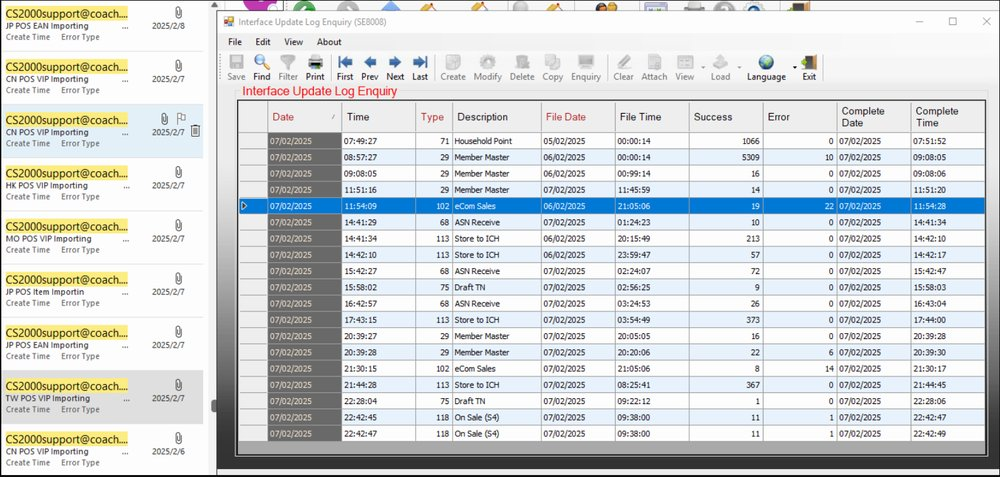
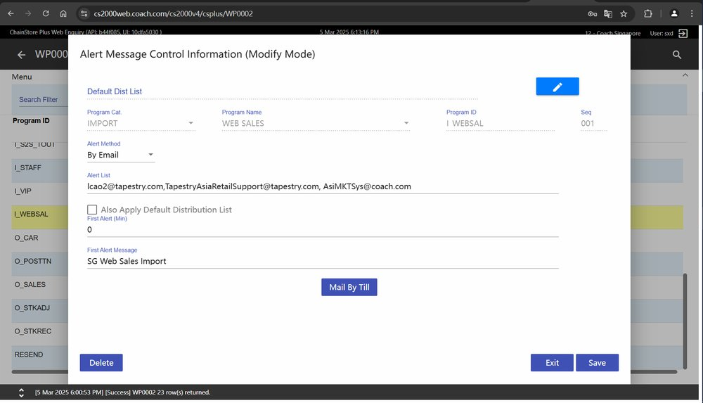
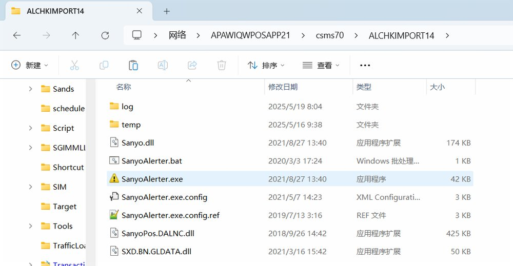
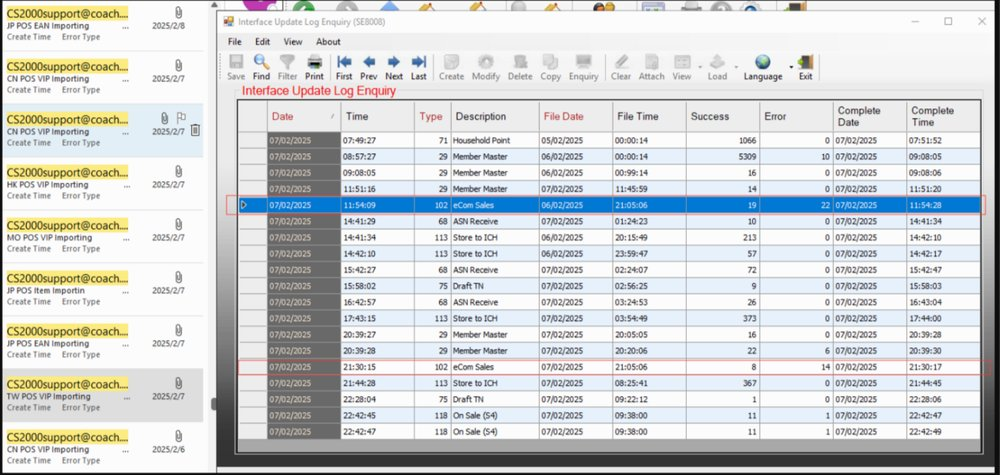
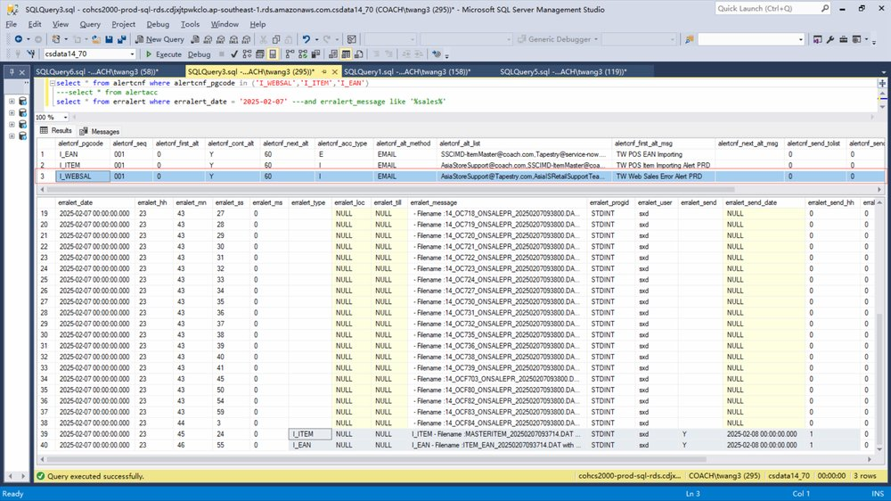

FE-1638: Not able to receive Ecom sales import alert email

## 症狀

Ecom 銷售匯入（Ecom Sales Import）發生錯誤時，系統未自動發送 Email Alert 通知。雖然在 CS2K Web 中已設定 Ecom sales error Email Alert，但實際發生 import error 時不會觸發郵件通知。

## 根因

Ecom 銷售匯入程式（Coach_ECOMM）使用的 erralert 類型為「I_ECOM_SAL」（對應 interlog_file_type = 102），但 alertcnf 設定表中僅包含「I_WEBSAL」、「I_ITEM」、「I_EAN」三種類型的郵件通知設定，缺少「I_ECOM_SAL」的 alert 設定，導致無法觸發郵件通知。

## 解法

於 alertcnf 資料表中新增「I_ECOM_SAL」的郵件通知設定。修正版本：BE V70R3.103（2025-05-15 發佈）。

## 相關資訊

- Jira: [FE-1638](https://ctil.atlassian.net/browse/FE-1638)
- Fix Version: BE-V70R3.103
- 解決日期: 2025-07-04
- 組件: Service
- 負責人: Jerry Wong
- 附件: [20250519ALCHKPOLL.txt](https://ctil.atlassian.net/rest/api/3/attachment/content/57106) | [ALCHKIMPORT14.zip](https://ctil.atlassian.net/rest/api/3/attachment/content/57227) | [ALCHKPOLL13 Pro.zip](https://ctil.atlassian.net/rest/api/3/attachment/content/57167) | [DAL20250519.log](https://ctil.atlassian.net/rest/api/3/attachment/content/57107) | [image-20250305-101307.png](https://ctil.atlassian.net/rest/api/3/attachment/content/52576)

## 相關截圖

> 共 7 張截圖，[查看全部](../attachments/FE-1638/)
