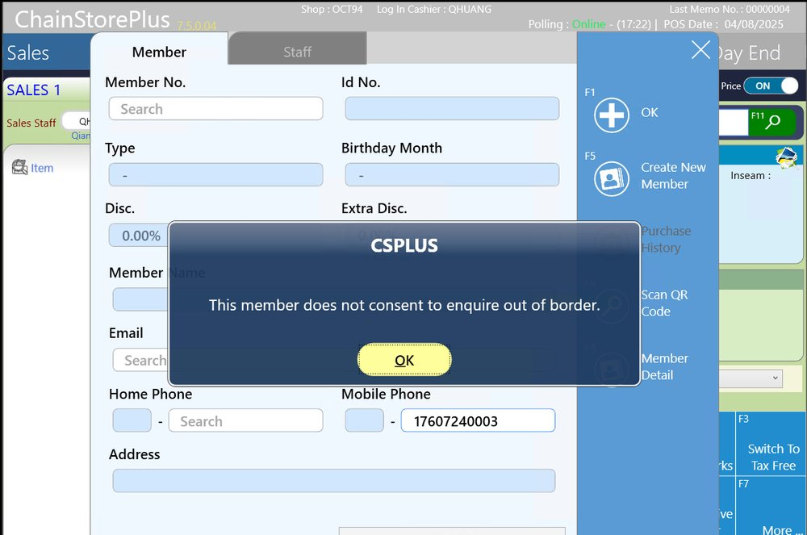

WEB-404: TW CRM - Cross border should only happen for CN member, rest regions no need

## 症狀

台灣（TW）會員在 POS 查詢時，系統不必要地檢查跨境（Cross Border）政策，而跨境政策僅應適用於中國（CN）會員，導致 TW 會員查詢出現非預期的跨境提示。

## 根因

AWS 環境中 BEGWCRM 與 BEAPICRM 服務未依區域分離部署，導致所有區域的 CRM API 請求都經過相同的跨境政策檢查邏輯。

## 解法

將 BEGWCRM 與 BEAPICRM 服務按區域分離部署至 AWS（無需程式修改，僅為配置調整）。已於 BE-V70R3.114 版本修正（2025-08-06 發佈）。

## 相關資訊

- Jira: [WEB-404](https://ctil.atlassian.net/browse/WEB-404)
- Fix Version: BE-V70R3.114
- 解決日期: 2025-08-07
- 組件: BEAPICRM
- 負責人: Joy Li
- 附件: [image-20250807-010942.png](https://ctil.atlassian.net/rest/api/3/attachment/content/62853)

## 相關截圖

