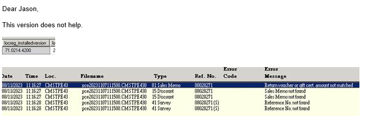
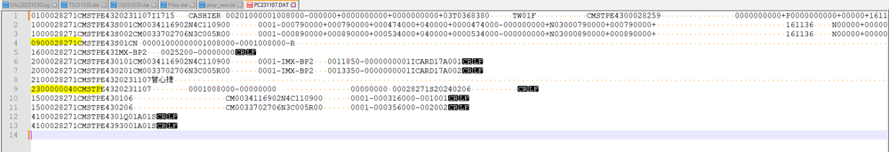

FE-1312: IMX V71 posting error "Return Voucher or gift cert amount not matched"

## 症狀

ImagineX（IMX）站點在升級 POS 版本後執行 posting 時出現錯誤：「Return Voucher or gift cert amount not matched」，導致資料拋轉失敗。即使升級至 7.1.0.02R14ZP 問題仍存在。

## 根因

tblconfig 中的 ZlogFileType（PCD 分隔符號設定）未能從 'F'（固定長度 Fixed Length）成功變更為 'D'（Tab 分隔符號），導致產出的 PCD 檔案格式與後端預期不符，拋轉時金額比對失敗。

## 解法

（1）部署 schedulexec.exe 至 CS2000 資料夾，用於變更 PCD 分隔符號類型從 'F' 到 'D'；（2）部署 WritePCD.dll Patch 修正固定長度格式的 RV PCD 序號問題。Patch 路徑：\\ds411\share\POS_FE_Release\20231114 IMX v710.02R14ZQ Patch。

## 相關資訊

- Jira: [FE-1312](https://ctil.atlassian.net/browse/FE-1312)
- 解決日期: 2024-03-05
- 組件: Front End
- 負責人: Sang
- 附件: [screenshot-1.png](https://ctil.atlassian.net/rest/api/3/attachment/content/37892) | [screenshot-2.png](https://ctil.atlassian.net/rest/api/3/attachment/content/37894) | [ZlogFileType Setting.png](https://ctil.atlassian.net/rest/api/3/attachment/content/37891)

## 相關截圖

