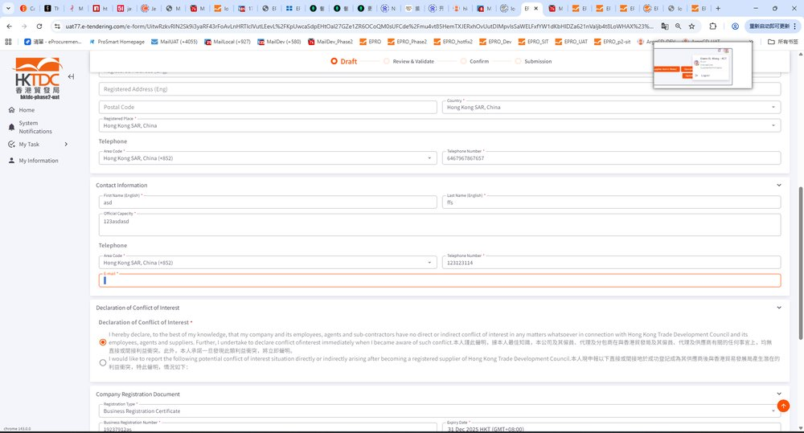
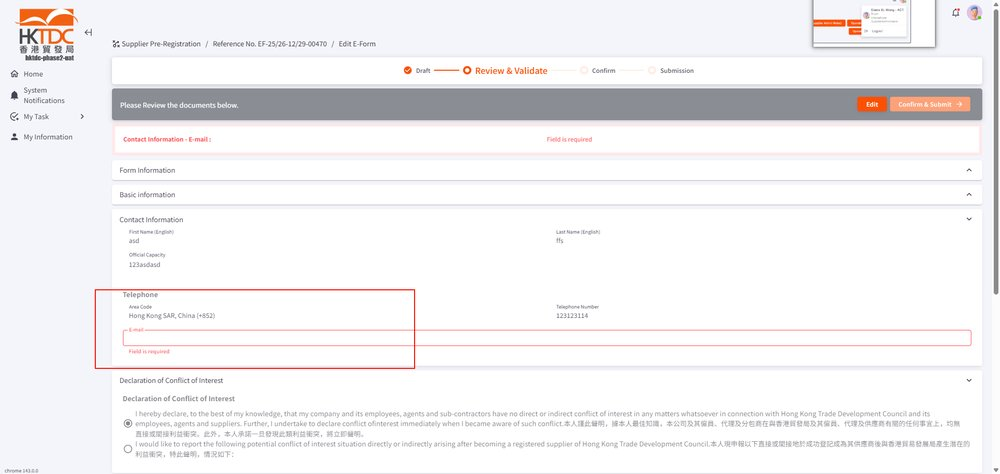
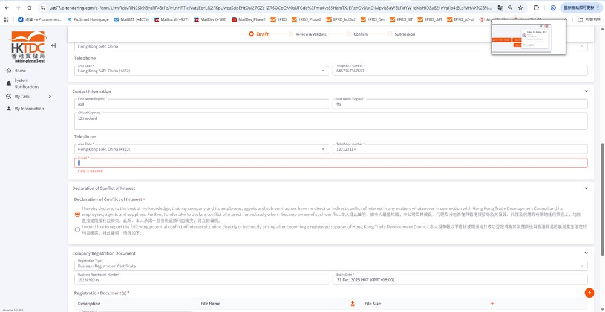

EPMTDCPROT-3283: EPRO-887 [Production] Email Address with Space for Supplier Registration / Account Activation

## 症狀

Why does adding a space after the email address during supplier pre-registration cause activation issues?

## 根因

## 解法

## 相關資訊

- Jira: [EPMTDCPROT-3283](https://ctil.atlassian.net/browse/EPMTDCPROT-3283)
- Fix Version: 未標註
- 分類: 錯誤與異常
- 專案: EPMTDCPROT

## 相關截圖

