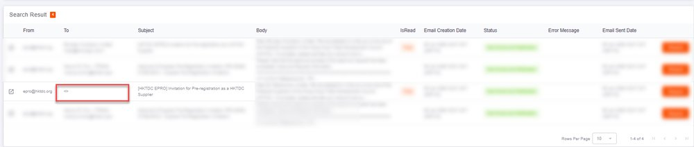
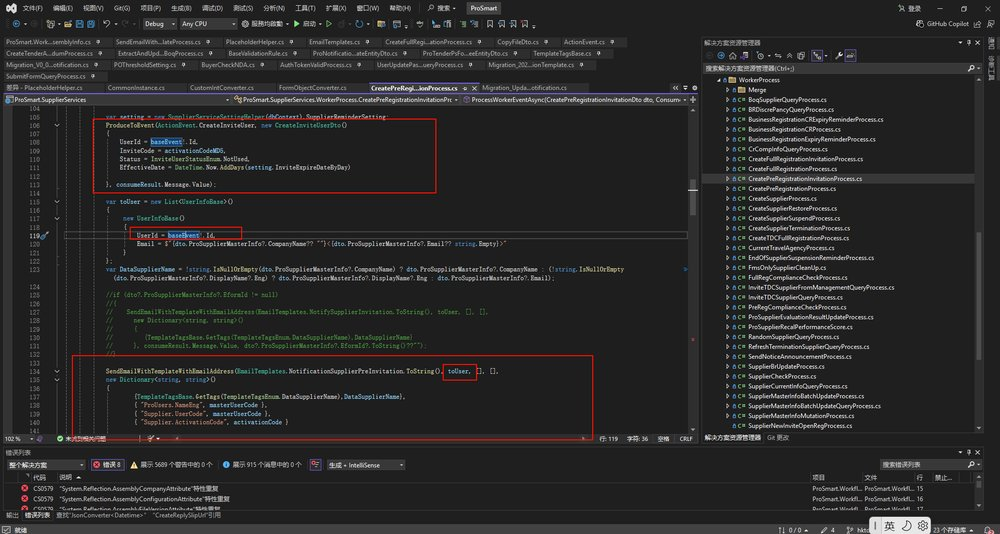
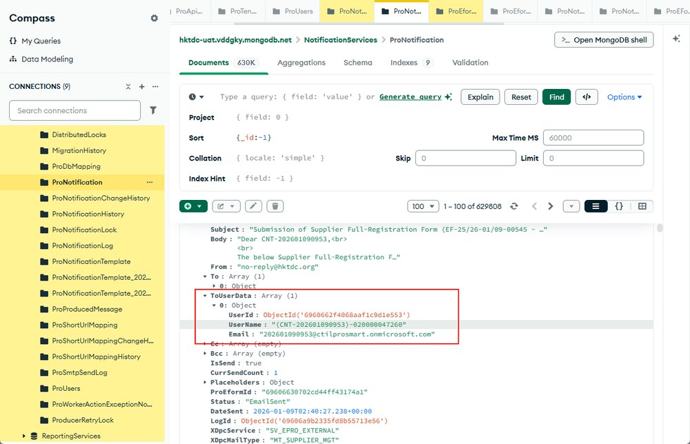
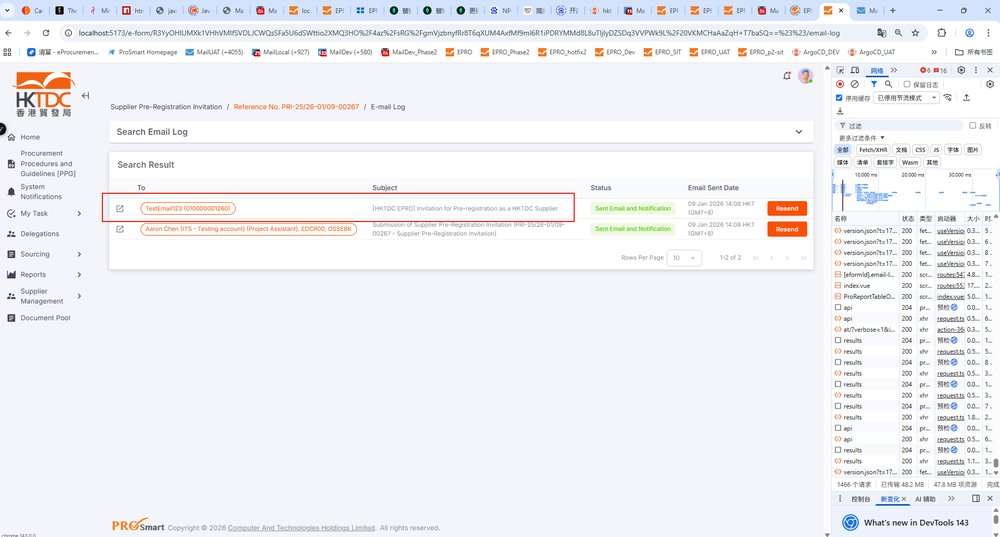

EPMTDCPROT-3291: EPRO-889 [Production] Email Log - Missing 'To'

## 症狀

Why is the 'To' field missing in the email log after sending supplier pre-registration invitations?

## 根因

## 解法

## 相關資訊

- Jira: [EPMTDCPROT-3291](https://ctil.atlassian.net/browse/EPMTDCPROT-3291)
- Fix Version: 未標註
- 分類: 錯誤與異常
- 專案: EPMTDCPROT

## 相關截圖

