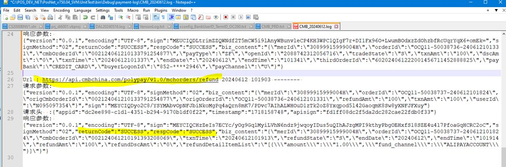

FE-1409: V75 - CS2K CMB Payment void failed

## 症狀

V75 FE 無法對 CMB 支付進行 void 操作。

## 根因

x64 版本的 POS 在 void CMB 支付時，錯誤調用了 32 位元的 EFTPaymentsServer.dll，導致方法調用失敗。

## 解法

修正 EFTPaymentsServer.dll 的調用方式以匹配 x64 架構，已於 KTS 240612 v750.04R04C 修復。

## 相關資訊

- Jira: [FE-1409](https://ctil.atlassian.net/browse/FE-1409)
- Fix Version: v750.04R04C
- 解決日期: 2024-08-02
- 組件: Payment
- 負責人: Sherman tse
- 附件: [CMB_20240612.log](https://ctil.atlassian.net/rest/api/3/attachment/content/42148) | [image-20240612-034833.png](https://ctil.atlassian.net/rest/api/3/attachment/content/42156) | [Void CMB sales memo testing - 20240621.xlsx](https://ctil.atlassian.net/rest/api/3/attachment/content/42463)

## 相關截圖

