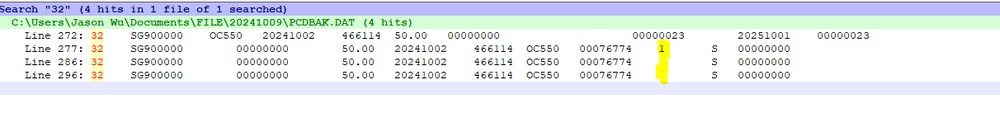

FE-1522: V75 Void Gift Cert caused posting error (DB Null)

## 症狀

在 V75 版本中，使用 Gift Cert（禮品券）進行 Void（取消）銷售/訂金/服務交易時，產生 Posting Error，錯誤訊息為 DB Null。此問題導致日結無法完成。

## 根因

使用 Gift Cert 進行 Void 交易時，程式寫入 PCD 的代碼不正確，導致後續 Posting 流程查詢資料庫時回傳 Null 值。正確應寫入 PCD 代碼「32」，但實際寫入的代碼有誤。

## 解法

修正程式邏輯：Void Sales/Deposit/Service 使用 Gift Cert 時，正確寫入 PCD 代碼「32」。修正版本：v750.04R05A（FE release: V75.004.0501.0000, 2024-10-17）。

## 相關資訊

- Jira: [FE-1522](https://ctil.atlassian.net/browse/FE-1522)
- Fix Version: V750.04R05A
- 解決日期: 2024-10-18
- 組件: Front End
- 負責人: Jason Wu
- 附件: [75.004.0501.0000_20241017.msg](https://ctil.atlassian.net/rest/api/3/attachment/content/47072) | [image-20241009-091113.png](https://ctil.atlassian.net/rest/api/3/attachment/content/46630)

## 相關截圖

