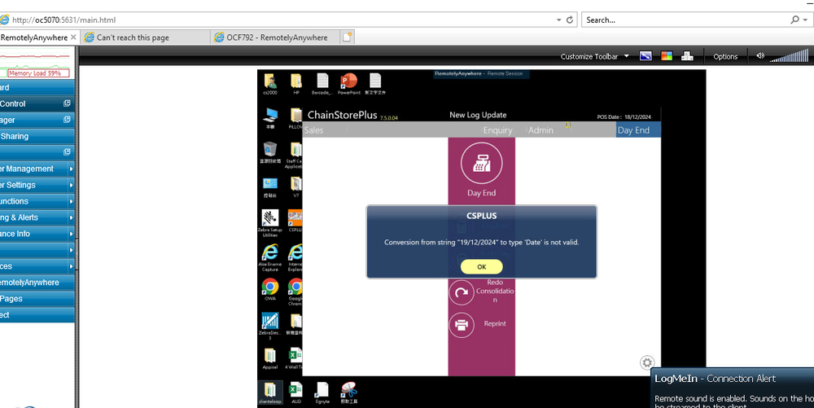
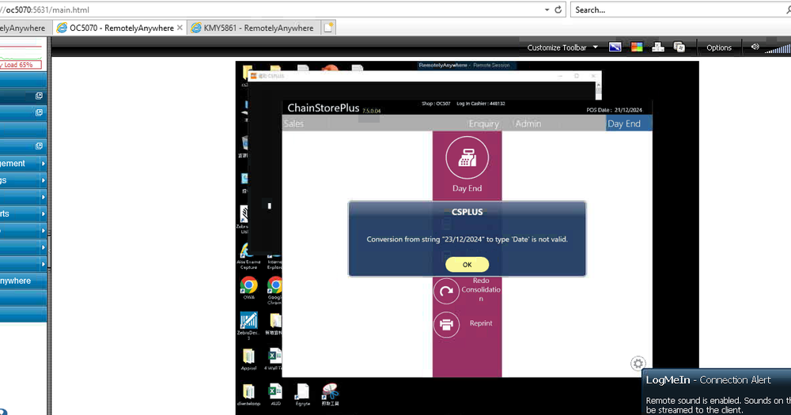
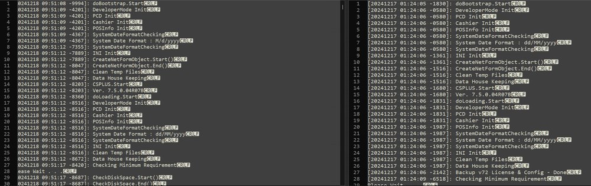
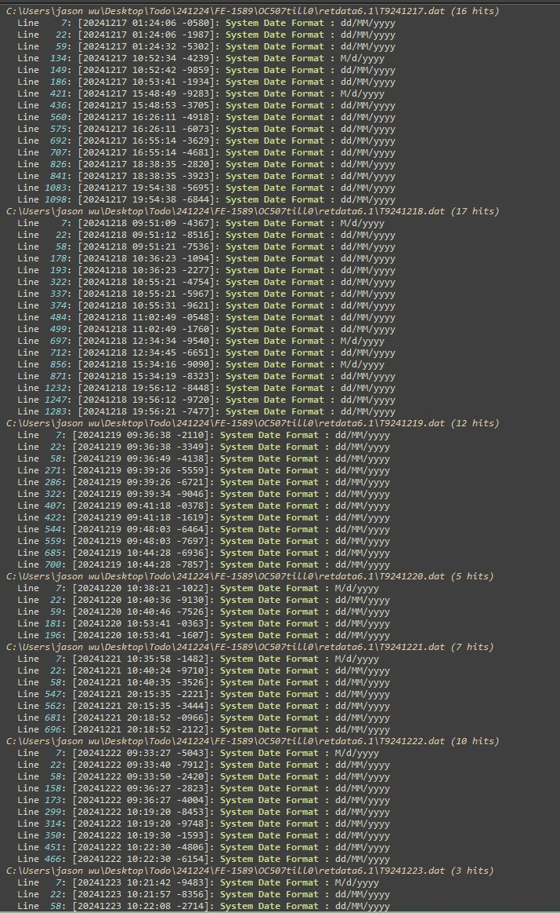

FE-1589: Till 0 cannot finish dayend, showing "Conversion from string 19/12/2024" to type Date is not valid"

## 症狀

Till 0無法完成日結（Day End），系統持續顯示錯誤「Conversion from string 19/12/2024 to type Date is not valid」，合併報表（Consolidation Report）無法產出，導致後續其他Till也無法正常啟動

## 根因

Windows系統的日期格式被其他應用程式變更為M/d/yyyy，而POS標準日期格式為dd/MM/yyyy。POS登入時會自動將系統日期格式改為dd/MM/yyyy，但若登入後又被改回M/d/yyyy，則合併日結（Consolidate Day End）處理時日期解析失敗

## 解法

修正合併日結處理程式，使其同時支援M/d/yyyy與dd/MM/yyyy兩種日期格式。修正包含於v750.04R10（及回溯版本v750.04R09H）。若為緊急處理，可先檢查並修正Windows控制台的地區日期格式設定為dd/MM/yyyy

## 相關資訊

- Jira: [FE-1589](https://ctil.atlassian.net/browse/FE-1589)
- 解決日期: 2025-04-29
- 組件: Front End v750.01R01A
- 負責人: Jason Wu
- 附件: [111.png](https://ctil.atlassian.net/rest/api/3/attachment/content/49526) | [111 (06aa8ec6-3110-40f7-a945-96d8ab2d505f).png](https://ctil.atlassian.net/rest/api/3/attachment/content/49657) | [222.png](https://ctil.atlassian.net/rest/api/3/attachment/content/49527) | [241223 FE-1589 Issue Study.docx](https://ctil.atlassian.net/rest/api/3/attachment/content/49589) | [image-20241224-083527.png](https://ctil.atlassian.net/rest/api/3/attachment/content/49644)

## 相關截圖

.jpg)

> 共 9 張截圖，[查看全部](../attachments/FE-1589/)
