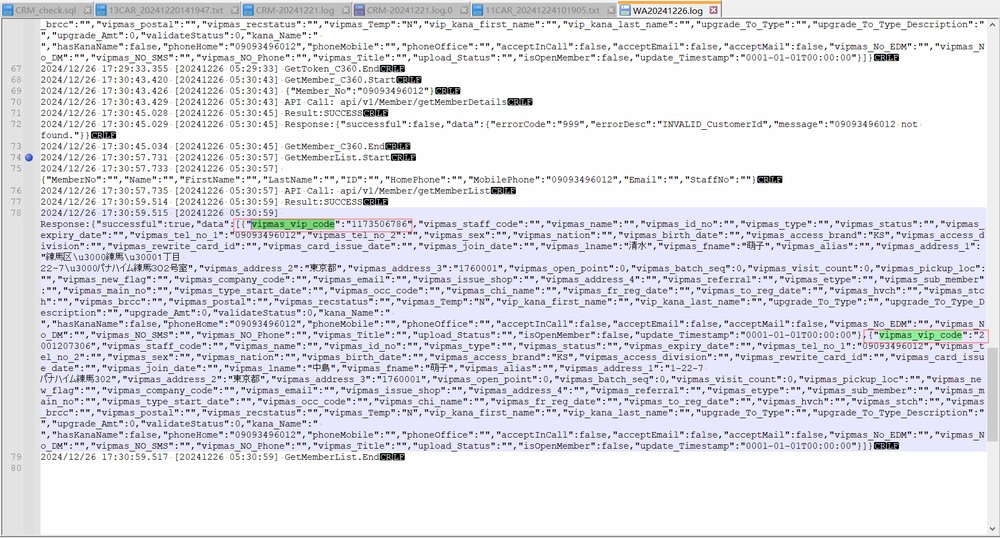
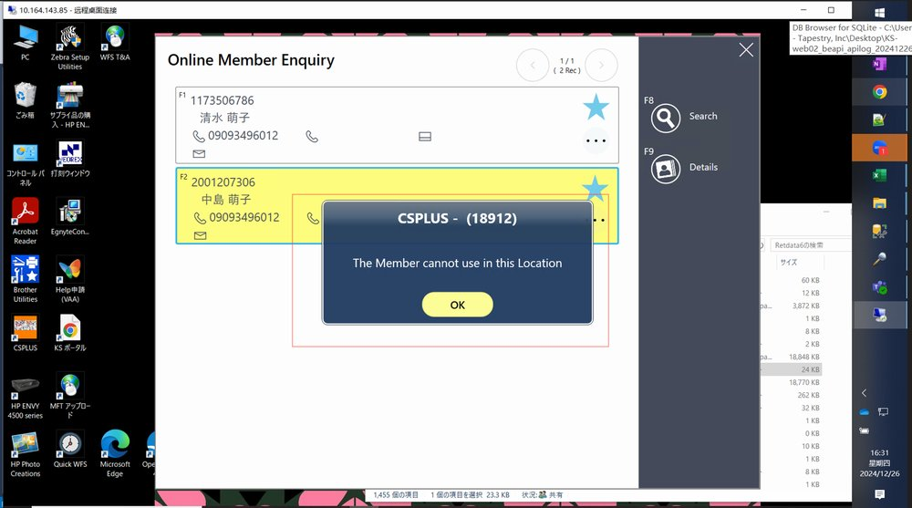
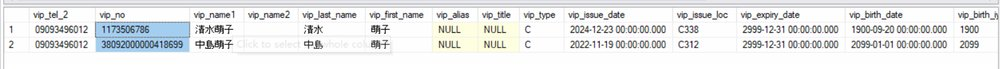
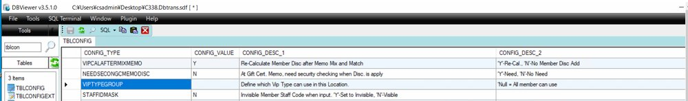

FE-1595: RIN01434013 - JP - C338  - CS2000 - FE : Can't use the vip no after the member no searched out in POS

## 症狀

V75 版本 POS 使用電話號碼搜尋會員時，若同一電話號碼關聯多個 VIP 號碼，選擇任一 VIP 後系統無反應或顯示「The Member cannot use in this Location」，導致店鋪無法正常使用會員功能。此問題在 V72 不存在，多家店鋪（C338、C385）均回報相同問題，影響店鋪日常營運。

## 根因

V75 版本新增了線上會員驗證邏輯（Validate Online Member），當 C360 第三方 CRM 回傳的會員資料中缺少會員類型（Member Type）定義時，系統會阻擋該會員的使用。而 V72 直接使用會員資料不進行驗證，故不受影響。

## 解法

修正於 v750.04R09F，新增 Validate Member Enhancement 邏輯。透過 tblconfig.ValidateOnlineMember 設定（預設 'N'）控制非員工會員的驗證行為，更新後 POS 可正確識別並選用同一電話號碼下的多個 VIP 號碼。

## 相關資訊

- Jira: [FE-1595](https://ctil.atlassian.net/browse/FE-1595)
- 解決日期: 2025-02-20
- 組件: Front End
- 負責人: Sang
- 附件: [image-20241226-095245.png](https://ctil.atlassian.net/rest/api/3/attachment/content/49659) | [image-20241226-100137.png](https://ctil.atlassian.net/rest/api/3/attachment/content/49660) | [image-20241226-101524.png](https://ctil.atlassian.net/rest/api/3/attachment/content/49662) | [image-20241226-101733.png](https://ctil.atlassian.net/rest/api/3/attachment/content/49663) | [image-20241231-040446.png](https://ctil.atlassian.net/rest/api/3/attachment/content/49781)

## 相關截圖

> 共 7 張截圖，[查看全部](../attachments/FE-1595/)
