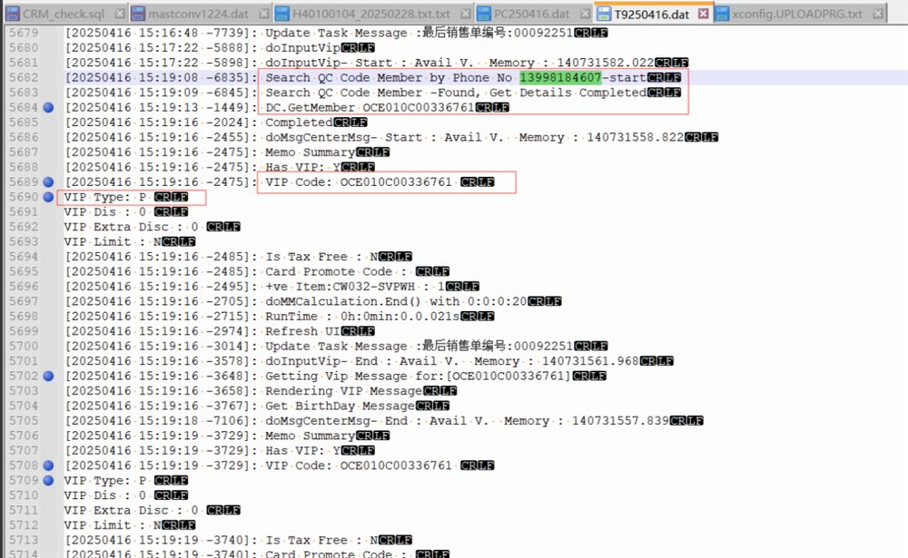
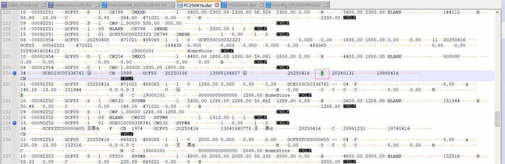
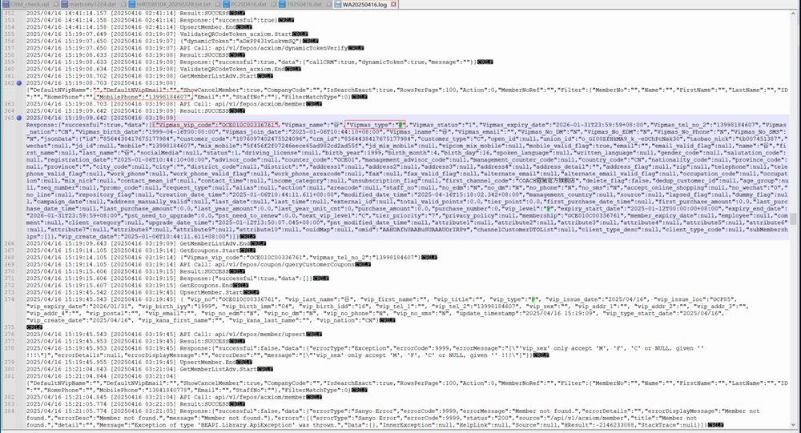

FE-1678: CAR Error - CN OCF85-00092252 Unknown vip type code 9999 04/17

## 症狀

中國大陸 POS 前台以手機號搜尋會員時，CAR 模組回報「Unknown vip type code 9999」錯誤。CRM 系統回傳的會員類型為 P type（Prospect），但 POS 後端無法正確處理此會員類型，導致交易無法完成。

## 根因

當 CRM 回傳 P type 會員資料時，Background Service 在執行 upsert 寫入資料庫的過程中，未將 P type 強制轉換為 C type，導致後續處理流程無法識別該會員類型代碼而報錯。此問題之前曾修復過，但因 Background Service 的轉換邏輯不完整而再次出現。

## 解法

在 BEAPI v1.7.18_20250424 版本中修復，確保 Background Service 執行 upsert 時會將 P type 會員強制轉換為 C type 後再寫入資料庫。Release：\\ds411\public\samuel\beapi\v1.7.18_20250424，於 2025年5月6日完成 QA 驗證。

## 相關資訊

- Jira: [FE-1678](https://ctil.atlassian.net/browse/FE-1678)
- 解決日期: 2025-05-06
- 組件: API
- 負責人: Anson Cheung
- 附件: [image-20250424-065551.png](https://ctil.atlassian.net/rest/api/3/attachment/content/55641) | [image-20250424-065622.png](https://ctil.atlassian.net/rest/api/3/attachment/content/55640) | [image-20250424-065717.png](https://ctil.atlassian.net/rest/api/3/attachment/content/55639) | [PC250416.dat](https://ctil.atlassian.net/rest/api/3/attachment/content/55642) | [T9250416.dat](https://ctil.atlassian.net/rest/api/3/attachment/content/55643)

## 相關截圖

