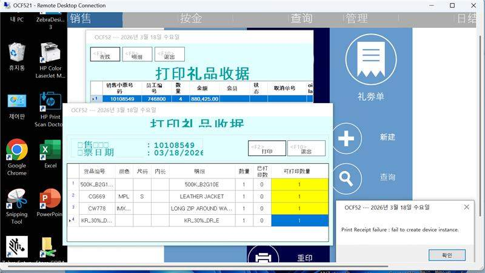
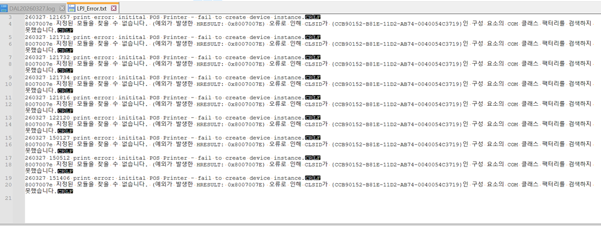
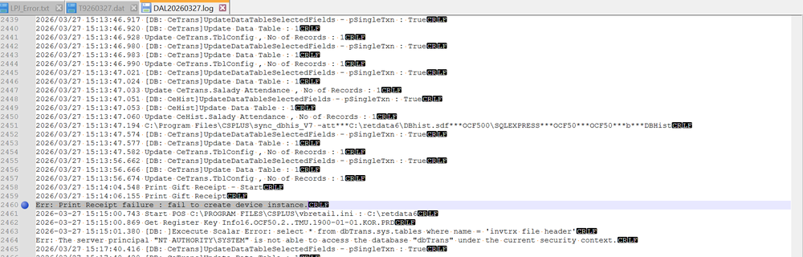
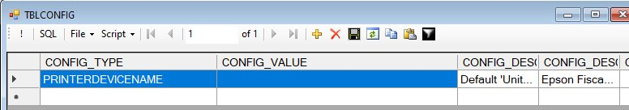

FE-1902: CS-2410          KR region, OCF52,OCF50 ,POS V75,gift print issue,error fail to create device instance

## 症狀

KR 地區 POS 列印禮券（Gift Receipt）時報錯「fail to create device instance」，但一般 memo 列印正常，OPOS healthcheck 也通過。

## 根因

PrintAgent 原本僅支援 GiftCertMemo 列印（MemoType=0），不支援 GiftCert 列印；且 FEPOS 沒有針對 KR 地區（需透過 PrintAgent 列印韓文字元）的額外處理邏輯。禮券列印流程走 PrintGiftReceipt → PrintMemoReceipt，與 sales memo 的 doPrint_Memo 路徑不同。

## 解法

擴展 CSPLUS 與 X32TMUPrint（v1.0.2）以支援 Gift Receipt 列印（MemoType=10），新增 tblconfig 參數 PRINTAGENTMEMOTIMEOUT 控制逾時，並修正部署路徑為 C:\Program Files\CSPlus\PrintAgent\X32TMUPrint.exe。已包含於 FE V75.004.2400.0000。

## 相關資訊

- Jira: [FE-1902](https://ctil.atlassian.net/browse/FE-1902)
- Fix Version: FE-75.004.2400.0000
- 解決日期: 2026-04-17
- 組件: Front End v750.01R01A
- 負責人: Sherman tse
- 附件: [f4ddde87-06cf-4890-ab92-b3ba627b251d.jpg](https://ctil.atlassian.net/rest/api/3/attachment/content/81130) | [image-20260327-062638.png](https://ctil.atlassian.net/rest/api/3/attachment/content/82048) | [image-20260327-064303.png](https://ctil.atlassian.net/rest/api/3/attachment/content/82050) | [image-20260327-064523.png](https://ctil.atlassian.net/rest/api/3/attachment/content/82051) | [image-20260402-080743.png](https://ctil.atlassian.net/rest/api/3/attachment/content/82745)

## 相關截圖

> 共 8 張截圖，[查看全部](../attachments/FE-1902/)
