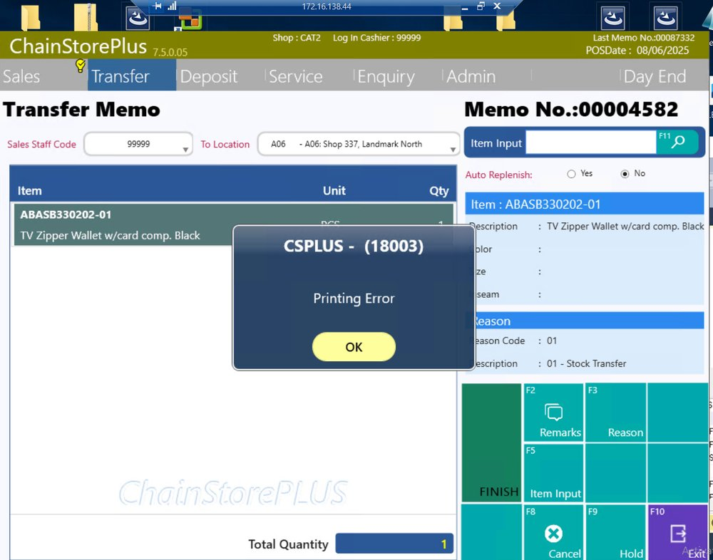
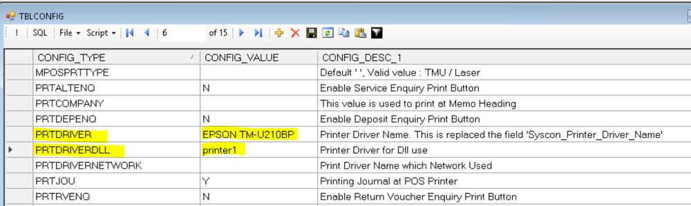
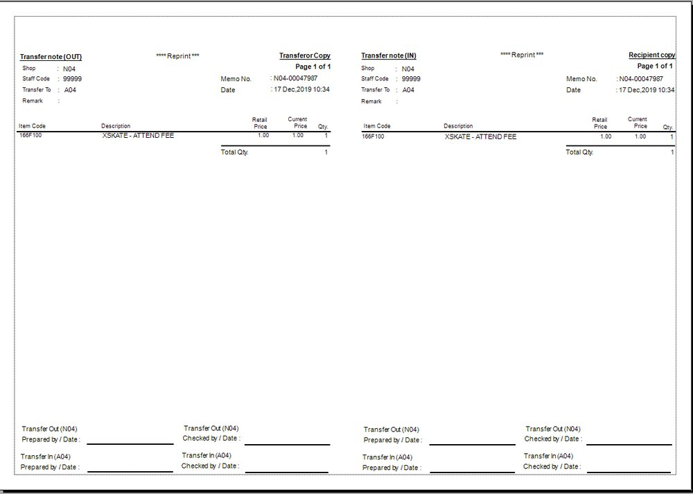
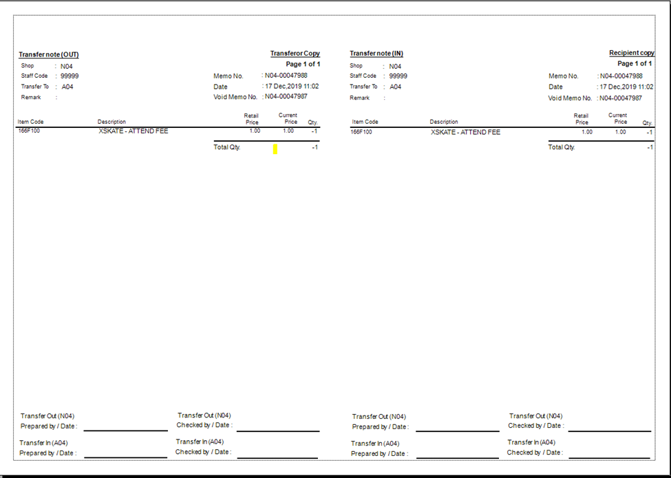
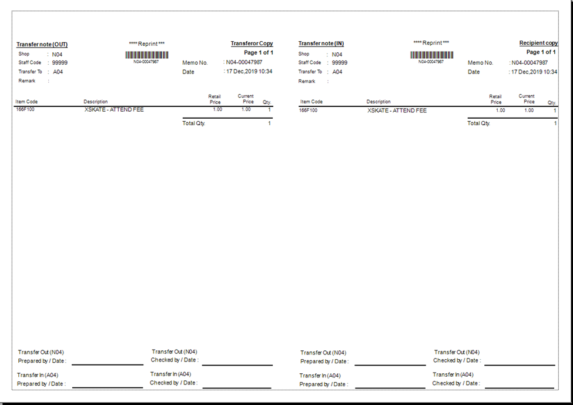

FE-1838: Fail to print out transfer receipt

## 症狀

SPH 品牌 POS 在列印轉貨收據（Transfer Out Receipt）時彈出「Printing Error」錯誤，無法成功列印。版本為 V75 7.5.0.05R03，即使列印設定正確仍無法列印轉貨收據及作廢轉貨單。

## 根因

舊版程式不支援透過 DotNet Crystal Report 方式列印轉貨收據，程式無法正確呼叫 SphTransferOutMemo.rpt 報表檔，導致列印失敗。

## 解法

更新 FE 程式至 v750.05R04 版本（2025/12/28 發布），該版本新增支援使用 DotNet CR 列印轉貨收據，並可透過 tblconfig.PRINTTROUTWITHBARCODE='Y' 控制是否列印條碼。程式路徑：\\ds411\share\POS_FE_Release_64\251228。

## 相關資訊

- Jira: [FE-1838](https://ctil.atlassian.net/browse/FE-1838)
- 組件: Front End
- 附件: [image-20251223-093609.png](https://ctil.atlassian.net/rest/api/3/attachment/content/71607) | [image-20251223-093932.png](https://ctil.atlassian.net/rest/api/3/attachment/content/71608) | [image-20251229-024759.png](https://ctil.atlassian.net/rest/api/3/attachment/content/71814) | [image-20251229-030349.png](https://ctil.atlassian.net/rest/api/3/attachment/content/71815) | [image-20251229-030437.png](https://ctil.atlassian.net/rest/api/3/attachment/content/71816)

## 相關截圖

