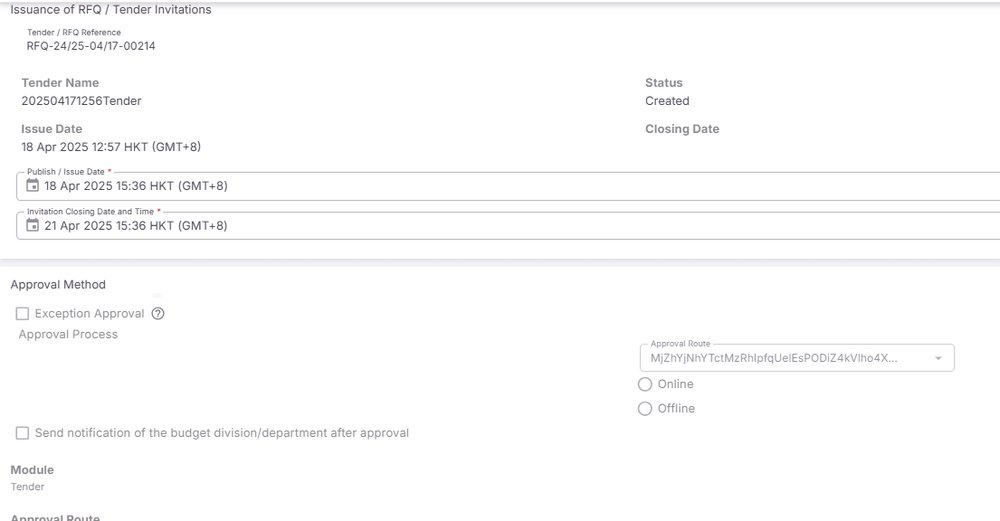
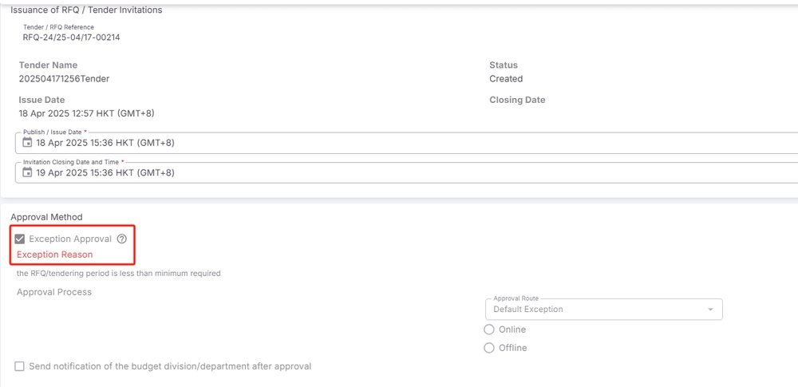

EPMTDCPROT-1277: Tender Issue e-form - Exception Approval required for the time frame between the issue date and closing date is less tha

## 症狀

為什麼Tender Issue e-form中當issue date與closing date之間的時間不足最低工作日時，沒有觸發Exception Approval？

## 根因

## 解法

## 相關資訊

- Jira: [EPMTDCPROT-1277](https://ctil.atlassian.net/browse/EPMTDCPROT-1277)
- Fix Version: 未標註
- 分類: 採購流程
- 專案: EPMTDCPROT

## 相關截圖

