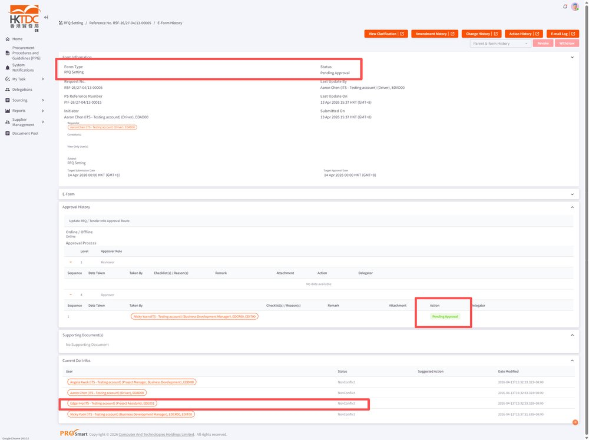
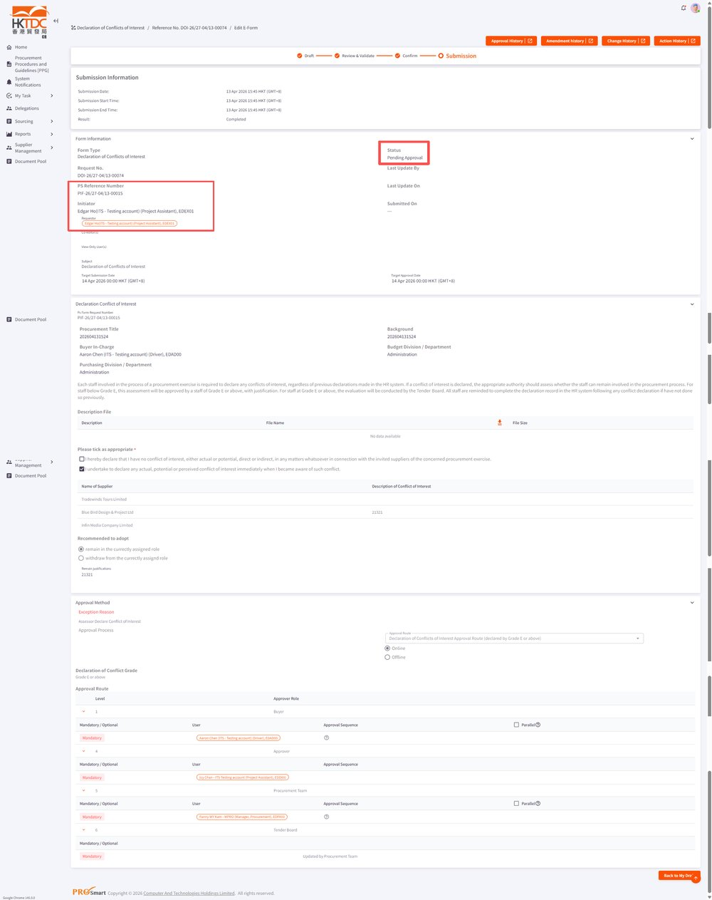
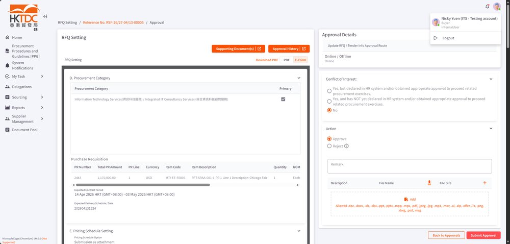
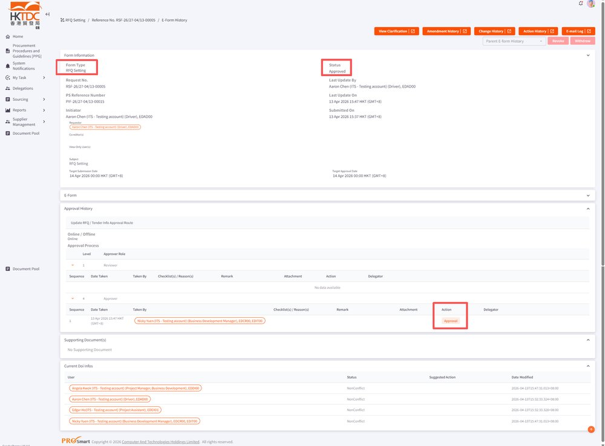
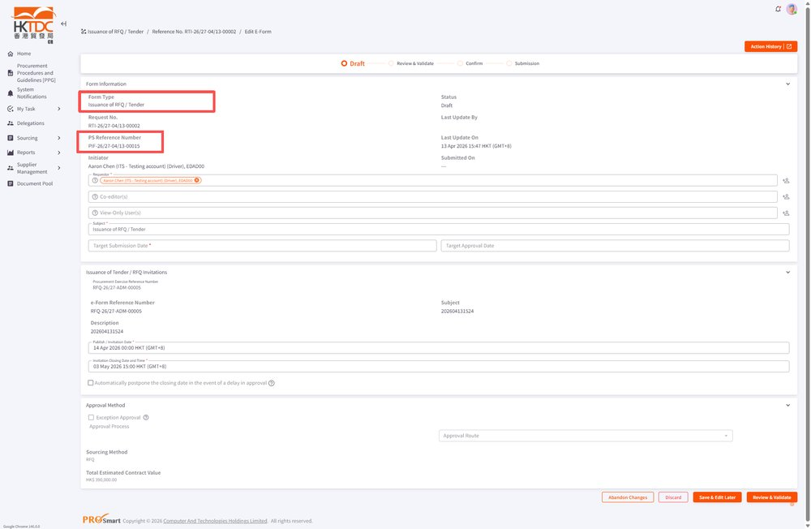

EPMTDCPROT-3499: [CR] 在part 1 已經 submit NonConflict，到rfq setting 時候 create doi submit Conflict，但是仲未approval 這張doi，rfq setting 仲可以繼續approv

## 症狀

在 Part 1 已提交 NonConflict DOI，但後續在 RFQ Setting 階段又提交了 Conflict DOI 且尚未獲批，為何 RFQ Setting 仍可繼續 Approval 而不受阻擋？

## 根因

根據 Comment (Gavin Zhou)：原先 DOI（Declaration of Conflicts of Interest）的 Conflict 檢查機制未涵蓋 RFQ Setting 階段的進行中流程。當使用者在 Part 1 提交 NonConflict 後，又於 RFQ Setting 階段提交 Conflict DOI 但尚未完成 Approval，系統未觸發 DOI 檢查，導致 RFQ Setting 可繼續進行至 Tender Issuance。

## 解法

修正 RFQ Setting 流程，在 Submit 後加入 DOI 完成狀態檢查：若存在尚未 Approval 的 Conflict DOI，RFQ Setting 將顯示「pending for DOI complete」並阻擋後續操作，直到 Conflict DOI 完成 Approval 為止。

## 相關資訊

- Jira: [EPMTDCPROT-3499](https://ctil.atlassian.net/browse/EPMTDCPROT-3499)
- Fix Version: 未標註
- 分類: 採購流程
- 專案: EPMTDCPROT

## 相關截圖

> 共 7 張截圖，[查看全部](../attachments/EPMTDCPROT-3499/)
