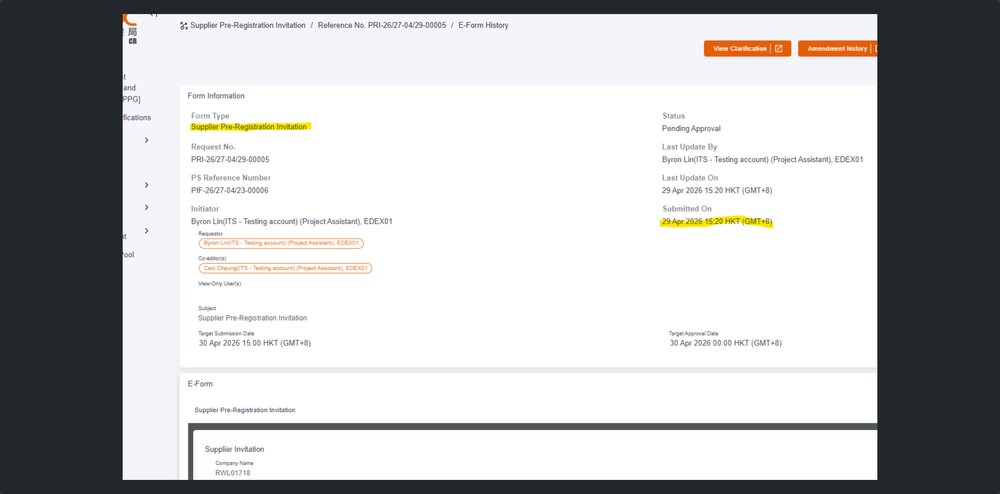
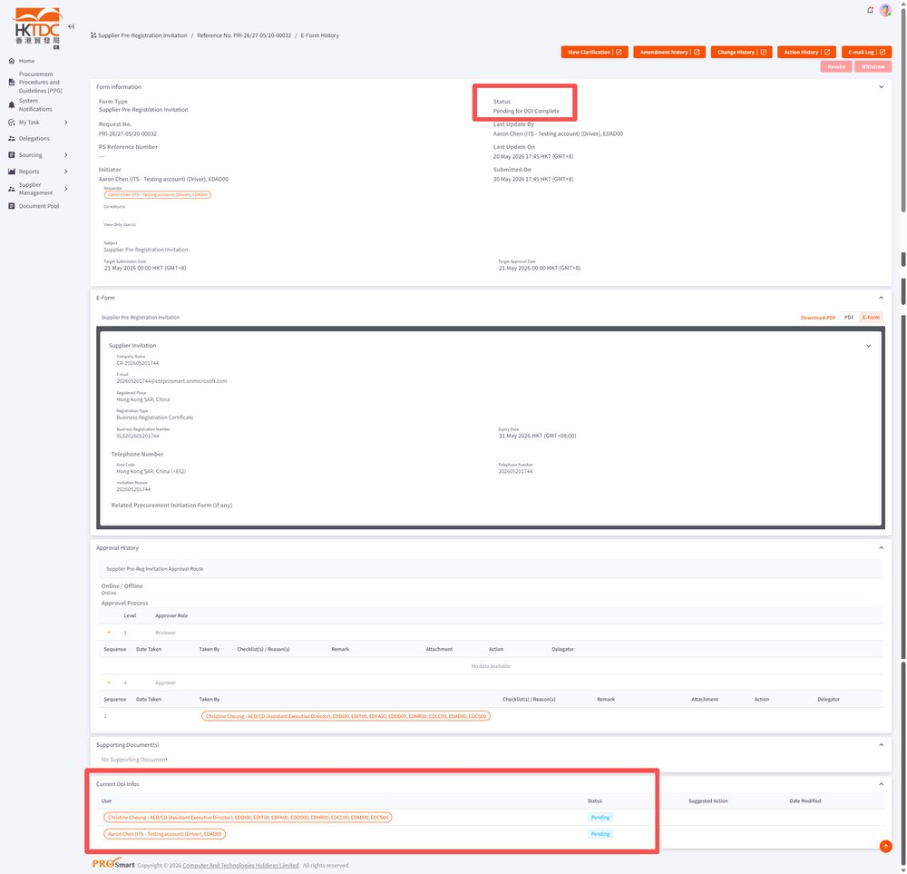
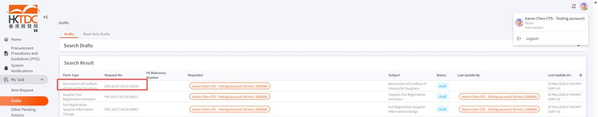
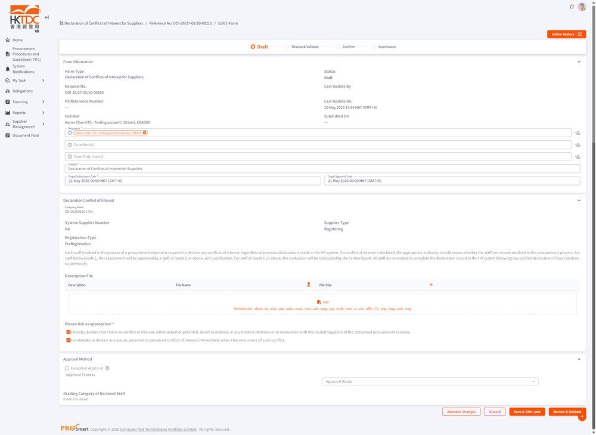
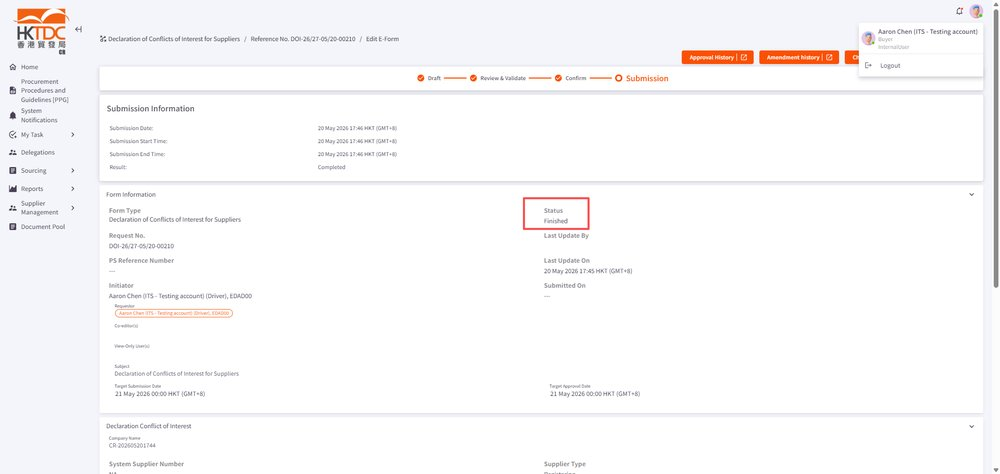

EPMTDCPROT-3550: EPRO-1027[CR] The DOI features under change request should also be applied for supplier management flows

## 症狀

Supplier Pre-registration Invitation e-form 提交後，DOI（Declaration of Interest）表單未自動生成給所有相關使用者及審批者。系統在 Change Request 流程中已實作 DOI，但未擴展至 Supplier Management 流程，導致 co-editor 與 approver 在 e-form 提交後不會收到 DOI 表單，違反 DOI 應適用於 supplier management 的設計要求。

## 根因

DOI 功能模組僅在 Change Request 相關流程中觸發，未針對 Supplier Management 流程（如 Supplier Pre-registration Invitation、Supplier Full Registration 等）掛載 DOI 生成邏輯。當 Buyer 提交 Pre-registration Invitation 選擇 approver 與 co-editor 後，系統未自動為相關人員建立 DOI e-form，導致審批鏈中缺少 DOI 環節。

## 解法

為 Supplier Pre-registration 及其他 Supplier Management 流程啟用 DOI 功能。所有被加入為 co-edit 或 view-only 的使用者，在 approval 前均須完成 DOI 流程；approver 也須完成 DOI 後方可進行審批。此修正已納入 Batch 3 測試，測試通過。

## 相關資訊

- Jira: [EPMTDCPROT-3550](https://ctil.atlassian.net/browse/EPMTDCPROT-3550)
- Fix Version: 未標註
- 分類: 採購流程
- 專案: EPMTDCPROT

## 相關截圖

> 共 16 張截圖，[查看全部](../attachments/EPMTDCPROT-3550/)
