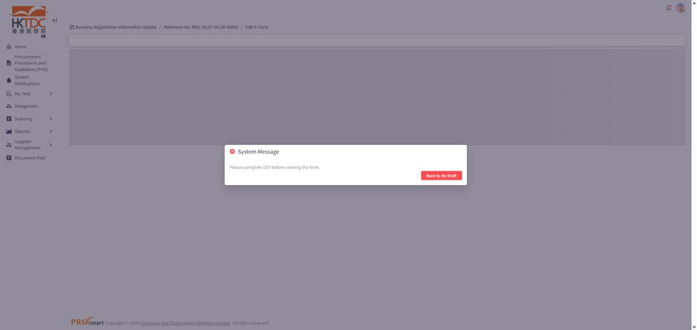
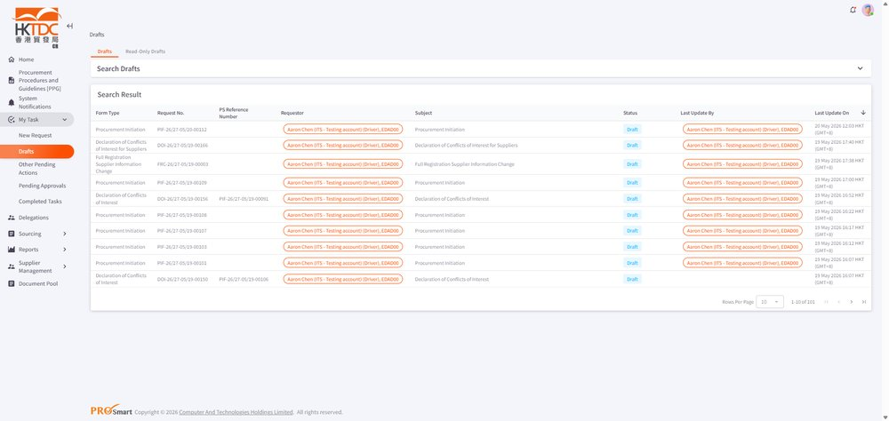
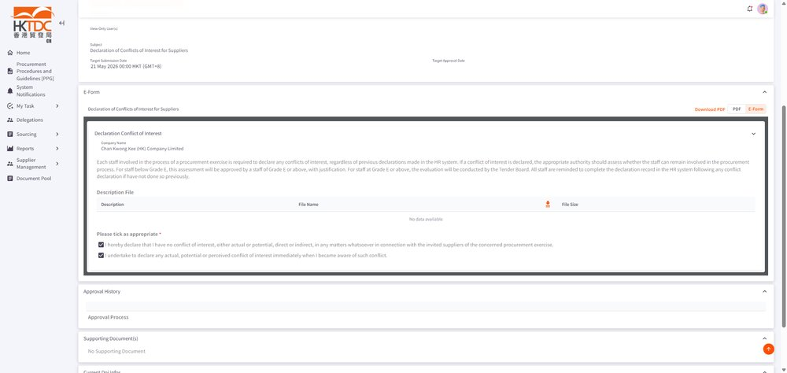
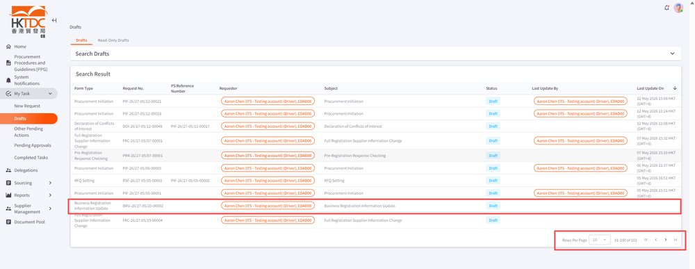

EPMTDCPROT-3602: [CR Supplier] full-reg info change / pre-reg info change / br update 這些create form 完成DOI後不會顯示在draft list的第一頁第一個

## 症狀

在完成 DOI 後創建的 Full-Reg Info Change / Pre-Reg Info Change / BR Update 表單，為何不會出現在 Draft List 的第一頁第一筆，而是跑到最後面？

## 根因

根據 Description 推測：可能是該表單缺少「Last Update On」時間戳記欄位，導致系統在排序 Draft List 時無法將其排在最新的位置，而掉到 Draft 的最後一頁。

## 解法

為這些表單加入「Last Update On」時間戳記，確保在完成 DOI 後創建的表單能被正確排序至 Draft List 的最前面（依最後更新時間降冪排列）。

## 相關資訊

- Jira: [EPMTDCPROT-3602](https://ctil.atlassian.net/browse/EPMTDCPROT-3602)
- Fix Version: 未標註
- 分類: 採購流程
- 專案: EPMTDCPROT

## 相關截圖

> 共 6 張截圖，[查看全部](../attachments/EPMTDCPROT-3602/)
