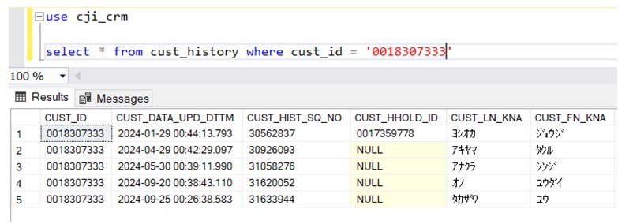
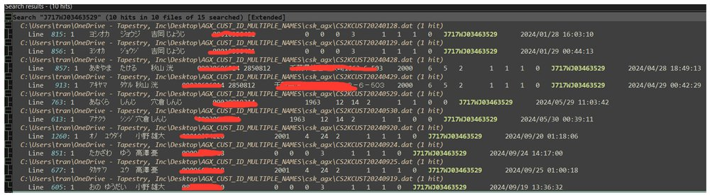
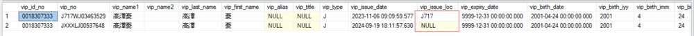
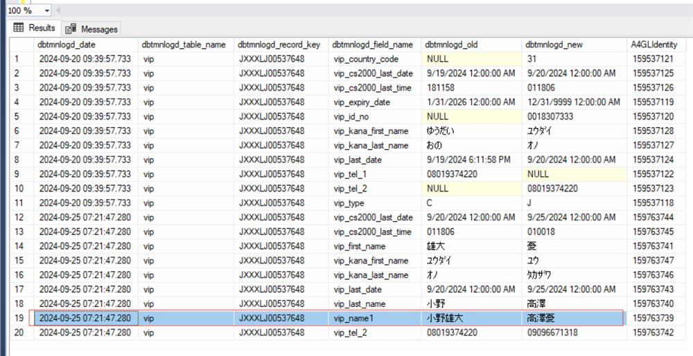

BE-1000: Same Member ID with different names and mobile numbers

## 症狀

同一個會員編號（Member ID）在 CS2K 系統中被關聯到多個不同姓名的客戶，導致傳送給 AGREX 的 CSK2CUST 檔案中出現同一 Member ID 對應不同姓名與手機號碼的異常狀況，AGREX 以此 Member ID 進行資料合併後造成客戶資料錯亂。

## 根因

店員（SA）未依正常流程操作 eName 建立會員，而是將 eName 會員建立流程的中間頁面加入 iPad 主畫面書籤，之後重複使用該書籤進入同一頁面建立新會員，導致多位客戶共用同一個 Member ID，每次建立都會覆蓋前一位客戶的資料。

## 解法

1. 教育店員依正常流程建立會員（從首頁進入，按「建立會員」按鈕開始完整流程）；2. 使用 MDM 推送的官方圖示進入 eName，勿使用中間頁面書籤；3. 刪除 iPad 上已存在的異常書籤捷徑。長期而言建議將 eName 改為 SPA 架構以避免此類操作。

## 相關資訊

- Jira: [BE-1000](https://ctil.atlassian.net/browse/BE-1000)
- 組件: eName
- 負責人: Anson Cheung
- 附件: [ENameCustomLog_20240128.sqlite](https://ctil.atlassian.net/rest/api/3/attachment/content/51366) | [ENameCustomLog_20240428.sqlite](https://ctil.atlassian.net/rest/api/3/attachment/content/51371) | [ENameCustomLog_20240529.sqlite](https://ctil.atlassian.net/rest/api/3/attachment/content/51372) | [ENameCustomLog_20240919.sqlite](https://ctil.atlassian.net/rest/api/3/attachment/content/51370) | [ENameCustomLog_20240920.sqlite](https://ctil.atlassian.net/rest/api/3/attachment/content/51267)

## 相關截圖

.png)

> 共 12 張截圖，[查看全部](../attachments/BE-1000/)
